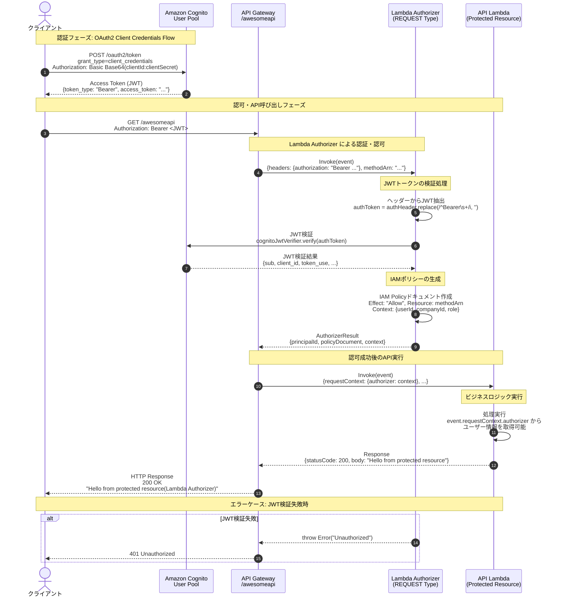

# lambda-authorizer-sample

Lambda Authorizerのサンプルコード

## このリポジトリの概要

このリポジトリは、AWS API Gateway の Lambda Authorizer（REQUEST タイプ）を使用したカスタム認証のサンプル実装です。Amazon Cognito の OAuth2 Client Credentials Flow で取得したアクセストークンを使用して、API エンドポイントへのアクセスを制御します。

**主な特徴:**
- AWS CDK（TypeScript）によるインフラストラクチャのコード化
- Lambda Authorizer による柔軟なカスタム認証
- Cognito User Pool と Resource Server を使用した OAuth2 認証
- JWT トークンの検証と API アクセス制御

**技術スタック:**
- AWS CDK 2.x
- TypeScript
- Node.js 24.x
- Amazon Cognito
- AWS Lambda
- Amazon API Gateway

## 機能一覧表

| 機能 | 説明 | 実装ファイル |
|------|------|--------------|
| **Cognito User Pool 管理** | OAuth2 認証用の User Pool とリソースサーバーの作成 | [lib/cognito-stack.ts](lib/cognito-stack.ts) |
| **Lambda Authorizer** | JWT トークンの検証とアクセス制御 | [src/custom-auth-lambda.ts](src/custom-auth-lambda.ts) |
| **API Lambda** | 保護されたリソースへのアクセス処理 | [src/api-lambda.ts](src/api-lambda.ts) |
| **API Gateway** | RESTful API エンドポイントの提供 | [lib/api-gateway-stack.ts](lib/api-gateway-stack.ts) |
| **OAuth2 Token 発行** | Client Credentials Flow によるアクセストークン取得 | Cognito OAuth2 エンドポイント |
| **JWT 検証** | aws-jwt-verify ライブラリによる JWT 署名検証 | [src/custom-auth-lambda.ts](src/custom-auth-lambda.ts) |

## システム構成図

```
┌─────────────────────────────────────────────────────────────────┐
│                         AWS Cloud                               │
│                                                                 │
│  ┌──────────────┐      ┌──────────────────────────────────┐   │
│  │   Cognito    │      │        API Gateway               │   │
│  │  User Pool   │      │  ┌────────────────────────────┐  │   │
│  │              │      │  │  /awesomeapi (GET)         │  │   │
│  │ - Resource   │      │  │                            │  │   │
│  │   Server     │      │  │  ┌──────────────────────┐  │  │   │
│  │ - App Client │      │  │  │ Lambda Authorizer    │  │  │   │
│  │ - Domain     │      │  │  │ (REQUEST Type)       │  │  │   │
│  └──────┬───────┘      │  │  │                      │  │  │   │
│         │              │  │  │ - JWT Verification   │  │  │   │
│         │              │  │  │ - Policy Generation  │  │  │   │
│         │              │  │  └──────────┬───────────┘  │  │   │
│         │              │  │             │              │  │   │
│         │              │  │  ┌──────────▼───────────┐  │  │   │
│         └──────────────┼──┼──│  API Lambda          │  │  │   │
│          JWT検証       │  │  │  (Protected)         │  │  │   │
│                        │  │  └──────────────────────┘  │  │   │
│                        │  └────────────────────────────┘  │   │
│                        └──────────────────────────────────┘   │
└─────────────────────────────────────────────────────────────────┘

                            ▲
                            │ HTTPS
                            │
                    ┌───────┴────────┐
                    │     Client     │
                    │  (REST Client) │
                    └────────────────┘
```

## 処理シーケンス図



## 動かし方

### インストール

```bash
pnpm i
```

### CloudFormation用のyamlファイルを生成

```bash
pnpm run cdk synth
```

### CDKスタックデプロイ

```bash
pnpm run cdk deploy '*'
```

### CDK スタック削除

```bash
pnpm run cdk destroy '*' --force
```

## デプロイ後の動かし方

`sample.http`に沿って動かすこと！

- CDK Output から API Gateway URL を取得して baseUrl に設定
- Cognito User Pool Client ID と Domain を取得
- Client Secret を AWS Console から取得
- Step 1: Cognito OAuth2 トークンを取得
- Step 2: 取得したアクセストークンを使用してAPIを呼び出す
- API呼び出し (Lambda Authorizerによる認証)

正常に Lambda Authoriserが機能していれば以下のような値が帰ってくるはず！

```bash
Hello from protected resource(Lambda Authorizer)
```